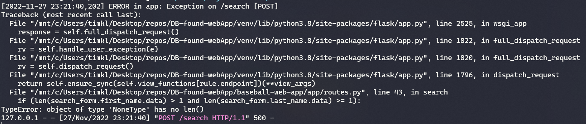

# DB-found-webApp

This is a class project for ~~blanked out~~.  It is built using the Flask/SQLAlchmey framework with a MariaDB backend.  Currently, the MaraiDB server needs to be run locally and requires some setup on inital use(See [Environment Info](#environment-information) for details on the environment needed).  Once Setup, a user can search through the Lahman Baseball database to find information on players that have played in the major leagues, with data stopping at the 2019 season.  Currently, only Batting information is retrieved, so if the player has no batting information they will not be present in this database.

### TOC
- [Using the site](#using-the-appsite)
- [Environment Setup](#environment-setup)
- [Worklog](#worklog)

---

# Using the app/site

## Setting up Database
- First, ensure MariaDB 10.6.8 is installed and operational on your local machine
  - No previous database setup is required besides initial setup
  - No testing on other versions were conducted, but newer version should work, and most versions of modern MariaDB should work
- 2 user profiles will be required from here
  - A root user to run all initial scripts
  - A limited access web user for interacting with the DB from the web application
    - This can be done using the script `updateDatabaseUsers.sql`
      - Ensure the proper IP is set for the user that is accessing the database
      - This can normally be local host if MariaDB is running on the same machine as the webApp.
      - If the webapp is being run on WSL while MariaDB is on native windows, this will require extra configuration steps
- All relevant scripts have been combined into a single file
  - Two options for loading from here:
    - DB dump located in `/sql/dbDumps/530_webapp_dump_12-1-22.sql`
      - This will create a database called `webapp_baseball` for use in the web application
      - Will also have test login's enabled, with saved searches already populate
      - Login information:
        - Username: `test_login`
        - password: `nohash`
        - **OR**
        - Username: `timtest`
        - Password `tim`
    - Init script located in `/sql/scripts/init_webapp_baseball.sql`
      - this will be a fresh database install with only one login and no saved searches
      - Login Information:
        - Username: `test_login`
        - password: `nohash`
- Leave MariaDB running for the webapplication to access

## Homepage
- After configuring the virtual environment as shown in [Environment setup](#environment-setup) navigate to `/baseball-web-app`
- From the shell, run `flask run` to initalize the devolpment environment
- Navigate to `127.0.0.1:5000` from a web browser to be presented with the homepage
- From the home page, a user must log in before any player searches can be done
- All navigation is done through a top navbar, that changes based on logged in status of the session

## Sign in
- Sign in information is located above, and is based on which method was used to init the database
- New users can also be registered from the `register` link at the bottom of the sign in form
  - New users require a unique username and email
  - Form validation is used to ensure fields are populated
- Once signed in, the user is presented with a welcomepage where the can either view saved players or start a new search

## Searching
- When earching, a minimum of two(2) letters for first name and one(1) letter for last name is required
  - If no resuts, the user will be prompted that no results are returned and can search again
  - If multiple results, see [Multiple Results](#multiple-results) section below
  - If a single result s returned, see [Single Results](#single-results) section below
- `POST` requests should only occur when form fields contain data
- WARNING: No SQL injection detection is implemented on this step

### Single results
- A single result will return a new page with a url ending in `/ba-analysis/<PlayerID>` where <playerID> is the searched players playerID as listed in the database
- The players name will be presented at the top of the page, alogn with a `Save player` button
  - Clicking the save player button will save this searched playerID to the currently logged in user for future searching
  - A success or failure message will occur after clicking the button
    - If the player has not been saved for this user, a success message will be returned and the playerid will be saved to the databse
    - If the player has been saved for this user, an error will occur, and no data will be saved to the database
- Below the player name, a table with rows matching baseballreference.com are shown
  - Reference image used for this can be seen in `/reference/MikeTroutPage_BBRef_web.png`
- If a user would like to search for another player, the user must navigate back to the search page

### Multiple results
- When a search has multiple matching player names, a table is returned showing all of the results
- The user can select from a dop down on which player they would like to continue searching on
- When selecting from the drop down, only players shown on the page are included, and once `submit` is clicked, the single result page is returned to the user

## Searching a saved player
- If a logged in user has any saved searches, they will be able to select from them to complete a search without having to re-enter the player name
- The display will include a table of the playerID and player name that is saved to the user
- A drop down selection will allow the user to select which player they would like to see
- Once submit is clicked, the single result page for the selected player is returned

## logging out
- When a user is done browsing, clicking the `Logout` button in the navigation bar will log the user out
- Once logged out, the navbar will revert to the default state
- A user cna either log back in, register a new account, or navigate away from the application at this point

---

# Dev Environment information

MariaDB
- 10.6.8

LahmanBaseballDB
- 2019, MySQL

Python 
- 3.8.10 (Running on WSL2 - Ubuntu)

Flask
- 2.2.2

---

# Environment setup

In the terminal, run the following commands to install dependicies...

_bash terminal_
```shell
sudo apt install python3.8-venv
python3 -m venv venv
. venv/bin/activate
pip install flask==2.2.2
pip install pymysql==1.0.2
pip install python-dotenv==0.21.0
pip install flask-wtf==1.0.1
pip install sqlalchemy==1.4.43
pip install flask-sqlalchemy==3.0.2
pip install flask-session==0.4.0
```

Ensrue the `/basebal-web-app/.flaskenv` file is configured to connect to your local database, example config below
```shell
FLASK_APP=baseball-web-app.py
SECRET_KEY=1234567890abcdefg1234abcde #required for session usage in flask
DB_USER=webwsl #created web user
DB_PW=dbrules #web suers password
DB_HOST=172.23.160.1 #host name for MariaDB server
DB_PORT=3306 #default port
DB_NAME=webapp_baseball #db name configured
```

If running vscode as editor, add the following environment settings...

_.vscode/settings.json_
```json
{
  "python.analysis.extraPaths": [
    "./baseball-web-app",
    "./venv/lib/python3.8/site-packages"
  ]
}
```

Database prep required
- All steps can be done from a fresh database install or be used to overwrite a previously modifed table
- Database is created as `webapp_baseball` once script is completed
  - The custom script is a combination of `2019lahman_base_dump.sql` and other customer scripts for creating tables and users for web application MVP
- script it located in `<parentDir>/sql/scripts/init_webapp_baseball.sql`
- script load time varies, around a minute to clean and then load and create all nessecary tables
  
Sql command to run script inside MariaDB *must be run as root user of DB*
```sql
source ./sql/scripts/init_webapp_baseball.sql
```

---

# Worklog
_12-1-22 [TK]_
- Completing final clean up of code/print statemnts for turnin
- updating readme
- Completing and adding sql dump file

_11-30-22 [TK]_
- Found an error when searching for some players
  - birth month is NULL for some players
  - verified in databse, seeing 281 players with null birth months, some even have null years as well
  - 
  - Fixed by adding `COALESCE` statments to birthYear/Month/Day update values
  ```SQL
  UPDATE analysis a SET a.birthYear = 
  (SELECT COALESCE(p.birthYear, 1832) FROM people p WHERE a.playerID = p.playerID);

  UPDATE analysis a SET a.birthMonth = 
    (SELECT COALESCE(p.birthMonth,1) FROM people p WHERE a.playerID = p.playerID);

  UPDATE analysis a SET a.birthDay = 
    (SELECT COALESCE(p.birthDay,1) FROM people p WHERE a.playerID = p.playerID);
  ```
- Combined Scripts into single `init_webapp_baseball.sql` file
  - Run this once and the DB gets set up for use
  - No database users are added with this yet
  - no saved searches table is generated yet (feature not available)
- Need to update instruction above for all updates so far
  - **NOT PRIORITY**

_11-29-22 [TK]_
- Updated readme
  - Added description
  - Added TOC
  - Marked off closed features
- Fixed multiple search results issue
  - now redirects to new page, dedicated to multiple search results
  - workaround for multiple form submittals on one page
  - allows for clean passing through the session variable
  - not finalized (just loops back to main search window for now)
- Finalized search returns
  - All final search results now work
  - redirects to new page with playerid as part of the URL
  - Have not checked safety of user inputting customer playerids causing possible issue
    - potential point for sql injection attack needs to be caught
  - All results appear to be working correctly
- Last feature missing is saving user search
  - This should be doable with a post request from the results page
  - Shouldnt change page output, just return the same page
  - Should not save the same results multiple times
  - Should save with the users logged in id to a table in the database
  - needs to be implemented

_11-27-22 [TK]_
- Updated PA calculation to use proper walks (BB instead of W)
- Added playerName field
  - This might be not needed, pending how to store/save names
  - Might be best to keep first and last seperate in table or just use first and last searching of People to return a playerid to use in the analysis table
- Completed Sign in form
  - Storing of hashed passwords
  - webusers table complete as well
  - Might need to error check ORM after removing plaintext password field
- Hooked up all pages correctly
  - Signin, home, search, register, logout
  - All connected, using title bar nav
  - CSS still needs work between them all
- Polished DB scripts
  - Still need to combine to a single sql script file to load database, and all required tables
  - Still need saved searches table completed and a way for users to save
    - Generic form template started for this
- Selecting single player from multiple when returned needs to be completed
  - Search field will no longer return 500, but not protected against sql injection attacks
  - Need to add link to go to aplayers page once created
  - Probably a simple redirect, using variable to a playerID
- General cleanup needs to be completed of unused variables, imports, etc
- Added Search drop down when more than one name is returned
  - Issue with onsubmit of new field
  - Need ot identify how to seperate it out from the normal on submit
  - give the following error:
  - 

_11-27-22 [KP]_
- Updated calculation for TOB
- Verified correct calculations by row
- Working on results table
  
_11-26-22 [KP]_
- Updated SQL statements for RC and PARC27 to account for division of 0 possibilities
- Added python script for querying the analysis table and printing results table
  - Currently takes in playerID, will need to adjust for name search

_11-26-22 [TK]_
- Updated createAnanlysis to fix running errors
  - modified to colasce values on insertion instead of having colasce be in every update calculation
  - PARC was returning multiple results, added predicates to correct this
  - Added RC27 back in at end to try and compare against parc27
    - Calculation may be incorrect, but not needed so to investigate later

_11-25-22 [KP]_
- Added SQL statements for subvariables for calculation
- Updated SQL statements for RC, PARC, PARC27

_11-16-22 [TK]_
- Tested loading of lahman database file
  - Requires modificatiosn to load correctly in maraiDB
  - Notes added on what changed to load successfully
- Adding scripts information to run
- Modified analysistable and orm.py file
  - age is now calculated on each search
  - Can probably change to just statically calculate instead of doing the calc on every search, or can just set it to update if the value is null only
- Discovered using WSL, the IP will reset on computer restarting
  - Need to follow steps to correct the IP for the connection and then the user that is logging in
  - This is manual process and a pain, should work on a way to automate the database user creation or something?
  - [WSL ip changes/possible static fixes](https://dev.to/agiboire/fixed-ip-for-wsl-instances-2ilf#:~:text=Every%20time%20a%20WSL%20instance,the%20WSL%20instance%20is%20running.)

_11-13-22 [TK]_
- Setup flaskenv and config and users for laptop dev
- added SavedSearches and WebUsers table creation scripts
  - These are just empty skeletons so far
  - To be updated when functionality is added to web-side of the house
- added ORM class for both new tables
  - Just skeleton classes to start with testing connections as needed
- Started on minor table formatting as well
  - Added style head to base.html
  - messed with padding and text alignment
  - needs more work, but can all be placed there

_11-12-22 [TK]_
- Got search working finally
- Issue was with running all the venv in WSL2 but MariaDB is run on windows
  - Some helpful links if you run into this:
    - [Find WSL 'localhost' equivelant to put in conn variable](https://devdojo.com/mvnarendrareddy/access-windows-localhost-from-wsl2)
    - [Enable MariaDB user to have remote access from the seperate 'machine'](https://webdock.io/en/docs/how-guides/database-guides/how-enable-remote-access-your-mariadbmysql-database#:~:text=By%20default%2C%20MariaDB%20allows%20connection,IP%20addresses%20on%20the%20system.&text=Change%20the%20value%20of%20the,0.1%20to%200.0.)
      - This one requires getting the IP that maria DB reports as attempting to connect when first setting up
      - Use the main server running window to get this info
      - I also had a lot of success testing with the VScode sql tools and mariaDB extensions
- Added note in search.html about variable names
  - they must match exact to the ORM, DO NOT TREAT LIKE NORMAL SQL QUERY HERE
- Updated environment variables and made sure it was clear what was needed for the connection issue
- MVP of search page is up and running, need to verify stats are calced correctly and get the corrected/missing stats inserted into the DB

_11-11-22 [TK]_
- Tried small debugging of connection error but no luck
-  Cant connect to the database for some reason
- Verified onnection is running
- Verifed 'web' user is created with 'dbrules' password
- Verifed direct maraiDB client login
- Still same error message:
  ```
  "Traceback (most recent call last):
  File "/mnt/c/Users/timkl/Desktop/repos/DB-found-webApp/venv/lib/python3.8/site-packages/pymysql/connections.py", line 613, in connect
    sock = socket.create_connection(
  File "/usr/lib/python3.8/socket.py", line 808, in create_connection
    raise err
  File "/usr/lib/python3.8/socket.py", line 796, in create_connection
    sock.connect(sa)
  ConnectionRefusedError: [Errno 111] Connection refused"
  ```
- Found reference in flask-sqlalchemy docs to try on next chance
  - [flask-sqlalchemy query](https://flask-sqlalchemy.palletsprojects.com/en/3.0.x/queries/)

_11-10-22 [TK]_
- Setting up environment variables and config.py as defaults
  - .flaskenv and config.py setup
  - SECRETKEY not set as actual key
  - User/password to be added to DB for use at this stage:
    - Added using users.sql script
      - user: web
      - pw: dbrules
      - SELECT, INSERT, UPDATE on all tables
- Modified search route to return results from previously build analysis table
- Socket onnection error currently, debug using config.py and .flaskenv setup for web@localhost and dbrules password

_11-9-22 [TK]_
- Had issue with ```flask run``` command
  - error on loading flask_sqlalchemy module
  - added pip install command to correct
  - working after adding flask-sqlalchemy v3.0.2
- Fixed search route bug
  - Typo in search.html
  - corrected if formatting in routes.py
  - Adjusted validation rules in forms.py
- Commented out DB connections to continue test runs
- Added wtforms docs link to references

_11-8-22 [TK]_
- Updated createAnalysisTable script to update some items
  - Issue with setting OBP
  - Getting "ERROR 1242 (21000): Subquery returns more than 1 row"
    - Fixed, needed to account that this table has stints for players
  - All other portions of Scripts work
  - Still missing PARC and PARC27 updates

_11-5-22 [TK]_
- Adding base sql file to base folder
- Adding structure for holding all sql scripts/database dumps
- Added check boxes and some more detail in todo section
- Updated worklog instructions
- add 'search' route
  - Basic form setup
  - Route added, can do post and get methods
  - Not confirmed on displaying correctly
  - Screen does not refresh when trying to hardcode a results test
- Added script for creating and inserting base values into analysis table
  - Verified correct, essentially just copies batting so we cna utilize a single ORM
  - May need to create a secondary people table later still to concat the player name
  - Or may just update the table creation for this one
- Added ORM for Analysis table
- Added SQLAlchemy
- Updated init.py for db connection setup
  - Have not set up and/or tested connection yet

_11-3-22 [TK]_
- Added reference folder to hold any reference material needed
  - included image from baseballreference.com
  - also included marked up image with first thoughts on page needs
- added todo items to top tracking
  - This should be broken out a little bit better?

_11-2-22 [TK]_
- Set up repo
- began basic instructions
- setup flask mvp
- stopped before working on webforms
  - added webforms before final sign off
  - based off template in reference tutorial
- Added DB link direct
- next steps
  - complete webforms
  - work on building orm's
  - try simple web app mvp with actual db information

# References

- [Flask Mega Tutorial post 3](https://blog.miguelgrinberg.com/post/the-flask-mega-tutorial-part-iii-web-forms)
- [DB Link](https://www.seanlahman.com/baseball-archive/statistics/)
- [WTForms documents v3.0.x](https://wtforms.readthedocs.io/en/3.0.x/)
- [flask-sqlalchemy docs v3.0.x](https://flask-sqlalchemy.palletsprojects.com/en/3.0.x/)
